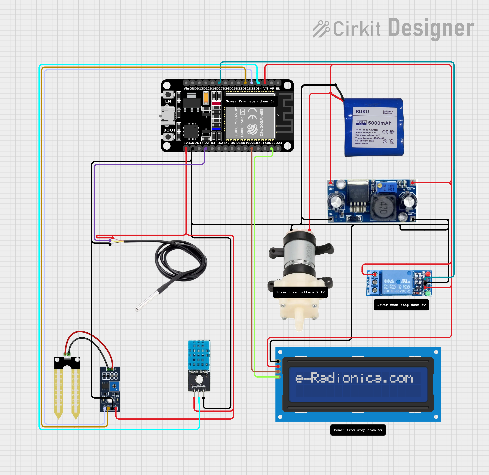
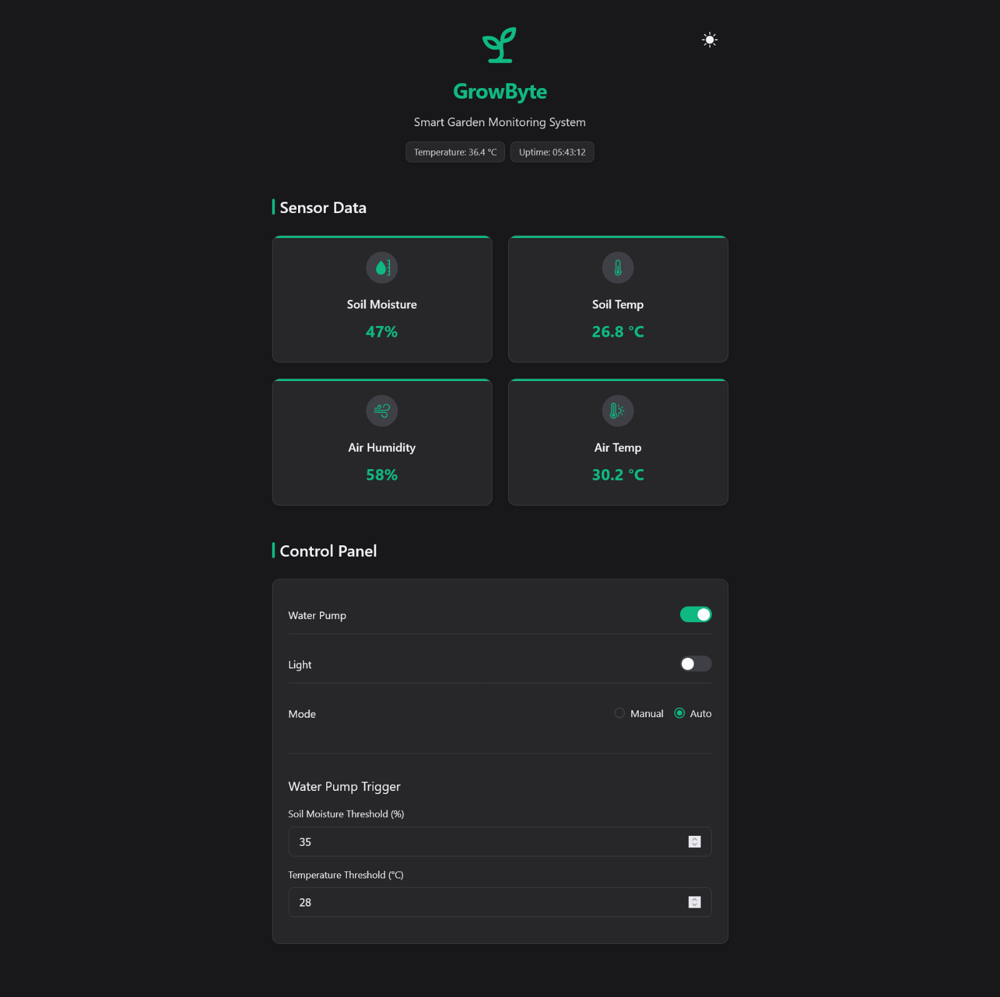

# GROWBYTE [WIP]

An IoT-based smart plant monitoring and control system using ESP32. It features real-time data from multiple sensors and allows control of a water pump and light through a responsive web interface.

## Features

- Read temperature and humidity using DHT sensor
- Read soil condition using analog sensor
- Read DS18B20 soil temperature
- Control water pump and light using relays
- Pump turns on automatically when soil is too dry
- Built-in web dashboard (hosted on ESP32)

## Hardware Used

- ESP32 Dev Board
- DHT11 Sensor
- DS18B20 Temperature Sensor (with 4.7kΩ pull-up resistor)
- Soil Moisture Sensor
- 2-Channel Relay Module
- DC Water Pump 12v
- LED light or light module
- LCD I2C Module
- Jumper wires

## Circuit Diagram



## Installation

1. Clone the Repository

```bash
git clone https://github.com/shironxn/growbyte
cd growbyte
```

2. Open with PlatformIO

- Install PlatformIO
- Open the folder with VSCode + PlatformIO extension

3. Upload Web Files LittleFS

```bash
pio run --target uploadfs
```

4. Upload Firmware

```bash
pio run --target upload
```

5. Wi-Fi Setup
   Connect to the ESP32 access point and open:

```
http://<ESP32_AP_IP>/wifi
```

6. Dashboard Access
   After connecting to your Wi-Fi, open the WIFI IP in your browser.

## Demo



## License

This project is licensed under the MIT License - see the [LICENSE](LICENSE) file for details.
